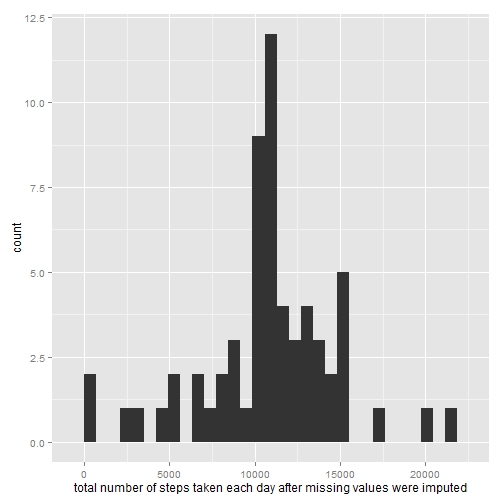

How to load the data
====================

First set your working directory to the
one that has the file "activity" and 
let's take a look!


```r
data<-read.csv("activity.csv")
str(data)
```

```
## 'data.frame':	17568 obs. of  3 variables:
##  $ steps   : int  NA NA NA NA NA NA NA NA NA NA ...
##  $ date    : Factor w/ 61 levels "2012-10-01","2012-10-02",..: 1 1 1 1 1 1 1 1 1 1 ...
##  $ interval: int  0 5 10 15 20 25 30 35 40 45 ...
```
We'll need also to load the following R packages.


```r
library(scales)
library(ggplot2)
```

What is mean total number of steps taken per day?
=================================================
Let's see the histogram of the total number of steps
taken each day and calculate the mean and the median
of the total number of steps taken per day


```r
total_steps<-data.frame()
mean_steps<-data.frame() 
median_steps<-data.frame()

one<-split(data,data$date)

for(i in 1:61){
  forawhile<-as.data.frame(one[i])
  
  if(is.na(forawhile[1,1])=="FALSE"){
    total_steps[i,1]<-sum(forawhile[,1])
    }
  else{
    total_steps[i,1]<-NA  
  }
}

mean_and_median<-cbind(mean(total_steps[,1],na.rm=T),median(total_steps[,1],na.rm=T))
mean_and_median<-as.data.frame(mean_and_median)
names(mean_and_median)<-c("mean_of_total_steps","median_of_total_steps")

ggplot(total_steps, aes(x=total_steps[,1])) + geom_histogram()+labs(x=expression("total number of steps taken each day"))
```

```
## stat_bin: binwidth defaulted to range/30. Use 'binwidth = x' to adjust this.
```

 

```r
print(mean_and_median)
```

```
##   mean_of_total_steps median_of_total_steps
## 1               10766                 10765
```
What is the average daily activity pattern?
===========================================
Let's make the time series plot of of the 5-minute interval (x-axis) and the average number of steps taken, averaged across all days (y-axis)!
Wondering also which 5-minute interval contains the maximum number of steps? Let's find it out!


```r
mean_of_interval<-data.frame()

subdata<-na.omit(data)
two<-split(subdata,subdata$interval)
for(i in 1:288){
  forawhile<-as.data.frame(two[i])
  mean_of_interval[i,1]<-mean(forawhile[,1])
  
  }
subdata[,4]<-mean_of_interval
names(subdata)<-c("steps","date","interval","mean_of_interval")

maxsteps<-aggregate(interval~mean_of_interval,subdata,max)
tail(maxsteps,n=1)
```

```
##     mean_of_interval interval
## 254            206.2      835
```
So,the interval 835,on average across all the days in the dataset, contains the maximum number of steps!

Now time for the plot! We don't want to have a plot for the intervals of 60,65,70,75 and etc, since they do NOT exist. So, we'll have to change the interval into
time!


```r
subdata[,3]<-sprintf("%04d",subdata[,3])
subdata[,3]<-as.POSIXct(strptime(subdata$interval,format="%H%M"))

ggplot(subdata,aes(x=subdata$interval,y=subdata$mean_of_interval))+ geom_line()+
  labs(x=expression("5-minute interval"),
       y=expression("average number of steps taken, averaged across all days"))+
       scale_x_datetime(labels = date_format("%H:%M"))
```

 
Imputing missing values
=======================
Let's take a first look, calculate and report the total number of missing values in the dataset

```r
summary(data) ;length(data[is.na(data)])
```

```
##      steps               date          interval   
##  Min.   :  0.0   2012-10-01:  288   Min.   :   0  
##  1st Qu.:  0.0   2012-10-02:  288   1st Qu.: 589  
##  Median :  0.0   2012-10-03:  288   Median :1178  
##  Mean   : 37.4   2012-10-04:  288   Mean   :1178  
##  3rd Qu.: 12.0   2012-10-05:  288   3rd Qu.:1766  
##  Max.   :806.0   2012-10-06:  288   Max.   :2355  
##  NA's   :2304    (Other)   :15840
```

```
## [1] 2304
```

There are 2304 NA's

So, we will devise a strategy for filling in all of the missing values in the dataset. "Mean of the 5-minute interval" i choose you!


```r
newdata<-data.frame()
new_total_steps<-data.frame()

newdata<-data
NaIndex<-which(is.na(newdata==TRUE))
newdata[NaIndex,1]<-mean_of_interval
```
Now all our NA's have been replaced with the mean of the corresponding 5-minute interval.

Let's check how this change affect our data.Hello again histogram!


```r
three<-split(newdata,newdata$date)

for(i in 1:61){
  forawhile<-as.data.frame(three[i])
    new_total_steps[i,1]<-sum(forawhile[,1])
  }

ggplot(new_total_steps, aes(x=new_total_steps[,1])) + geom_histogram()+labs(x=expression("total number of steps taken each day after missing values were imputed"))
```

```
## stat_bin: binwidth defaulted to range/30. Use 'binwidth = x' to adjust this.
```

 

It's noticeable that the new histogram is the same ,except from the fact that the average input from NA's increased the middle bar to the height 8 (8 days with NA's).
New Question...
Do the new mean and median values differ from the estimates from the first part of the assignment?
Let's find it out!


```r
hist(total_steps[,1],xlab="total_steps",main="Before change")
```

 

```r
hist(new_total_steps[,1],xlab="total_steps_with_having_filled_in_the_NAs",main="After change")
```

 

```r
new_mean_and_median<-cbind(mean(new_total_steps[,1],na.rm=T),median(new_total_steps[,1],na.rm=T))
new_mean_and_median<-as.data.frame(new_mean_and_median)
names(new_mean_and_median)<-c("new_mean_of_total_steps","new_median_of_total_steps")
print(new_mean_and_median)
```

```
##   new_mean_of_total_steps new_median_of_total_steps
## 1                   10766                     10766
```

```r
print(new_mean_and_median - mean_and_median)
```

```
##   new_mean_of_total_steps new_median_of_total_steps
## 1                       0                     1.189
```
We notice that there is only a slight increase on median (makes sense since 8 more days were introduced with the values of 10766)

Are there differences in activity patterns between weekdays and weekends?
=========================================================================
To answer this question,we need to check if the given days are weekdays or weekends.
Let's categorize them!

```r
newdata[,2]<-as.POSIXct(strptime(newdata$date,format="%Y-%m-%d"))
newdata[,2]<-weekdays(newdata[,2])

for(i in 1:nrow(newdata)){
  if(newdata[i,2]=="Saturday"|newdata[i,2]=="Sunday"){
    newdata[i,4]<-"weekend"
  }
  else{
    newdata[i,4]<-"weekday"
  }
}
names(newdata)<-c("steps","date","interval","day_category")
head(newdata)
```

```
##     steps   date interval day_category
## 1 1.71698 Monday        0      weekday
## 2 0.33962 Monday        5      weekday
## 3 0.13208 Monday       10      weekday
## 4 0.15094 Monday       15      weekday
## 5 0.07547 Monday       20      weekday
## 6 2.09434 Monday       25      weekday
```
How to make a panel plot containing a time series plot (i.e. type = "l") of the 5-minute interval (x-axis) and the average number of steps taken, averaged across all weekday days or weekend days (y-axis) for dummies.


```r
mean_of_days<-data.frame()
mean_of_ends<-data.frame()
daydata<-data.frame()
enddata<-data.frame()

four<-split(newdata,newdata$interval)

for(i in 1:288){
  
  last<-as.data.frame(four[i])
  lasttwo<-split(last,last[,4])
  
  for(j in 1:2){
    
    onepart<-as.data.frame(lasttwo[j]) 
    
    if(onepart[1,4]=="weekday"){
      mean_of_days[i,1]<-mean(onepart[,1])
    }
    else{
      mean_of_ends[i,1]<-mean(onepart[,1])
    }
  }
}

five<-split(newdata,newdata$day_category)
daydata<-as.data.frame(five[1])
enddata<-as.data.frame(five[2])
daydata[,5]<-mean_of_days
enddata[,5]<-mean_of_ends
names(daydata)<-c("steps","date","interval","day_category","mean")
names(enddata)<-c("steps","date","interval","day_category","mean")
metadata<-rbind(daydata,enddata)

metadata[,3]<-sprintf("%04d",metadata[,3])
metadata[,3]<-as.POSIXct(strptime(metadata$interval,format="%H%M"))

ggplot(metadata,aes(x=metadata$interval,y=metadata$mean))+ geom_line()+
  facet_grid(.~day_category)+
  labs(x=expression("5-minute interval"),
       y=expression("average number of steps taken, averaged across all weekdays or weekends"))+ scale_x_datetime(labels = date_format("%H:%M"))
```

 

Here is my project assignment over. 
I hope it was very interesting and understandable.
Thank you for your attention and your time!
THE END!!!
==========
